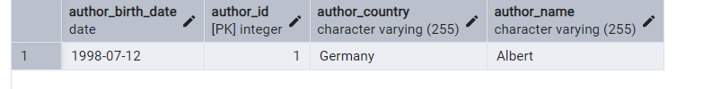
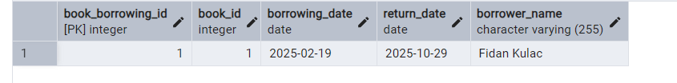
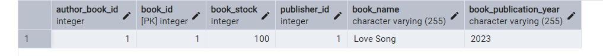
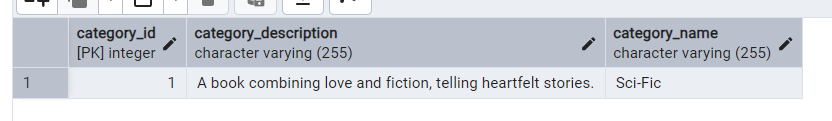
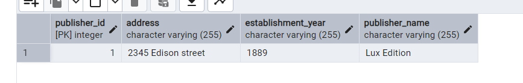

# Library Management System

This project is a simple Library Management System developed using Java and Hibernate, with PostgreSQL as the database.

---

## Technologies

- Java 17+
- Maven
- Hibernate / JPA
- PostgreSQL
- Jakarta Persistence API

---

## Project Structure

The project contains the following entity classes:

### 1. **Book**

- **id**: Unique book ID (Primary Key)
- **name**: Book title
- **publicationYear**: Publication year
- **stock**: Quantity available in the library
- **author**: Book's author (ManyToOne)
- **publisher**: Book's publisher (ManyToOne)
- **categories**: Book's categories (ManyToMany)
- **bookBorrowings**: Book borrowing records (OneToMany)

### 2. **Author**

- **id**: Unique author ID (Primary Key)
- **name**: Author's name
- **birthDate**: Author's date of birth
- **country**: Author's country
- **bookList**: Books written by the author (OneToMany)

### 3. **Category**

- **id**: Unique category ID (Primary Key)
- **name**: Category name
- **description**: Category description
- **books**: Books in this category (ManyToMany)

### 4. **Publisher**

- **id**: Unique publisher ID (Primary Key)
- **name**: Publisher name
- **establishmentYear**: Year of establishment
- **address**: Publisher address
- **bookLists**: Books published by the publisher (OneToMany)

### 5. **BookBorrowing**

- **id**: Unique ID (Primary Key)
- **borrowerName**: Name of the person borrowing the book
- **borrowingDate**: Borrowing date
- **returnDate**: Return date (null at first, updated upon return)
- **book**: Borrowed book (ManyToOne)

---

## Entity Relationships

| Relationship               | Type         | Description                                                                 |
|-----------------------------|-------------|-----------------------------------------------------------------------------|
| Book ↔ Author               | ManyToOne    | A book has one author, an author can have multiple books                   |
| Book ↔ Category             | ManyToMany   | A book can belong to multiple categories, a category can contain multiple books |
| Book ↔ Publisher            | ManyToOne    | A book has one publisher, a publisher can publish multiple books           |
| Book ↔ BookBorrowing        | OneToMany    | A book can have multiple borrowing records, each borrowing record belongs to one book |

---

## Author Table

---
## Book Borrowing Table

---
## Book Table

---
## Category Table

---
## Publisher Table

---
## Book Category Table
Created By @ManyToMany

---
